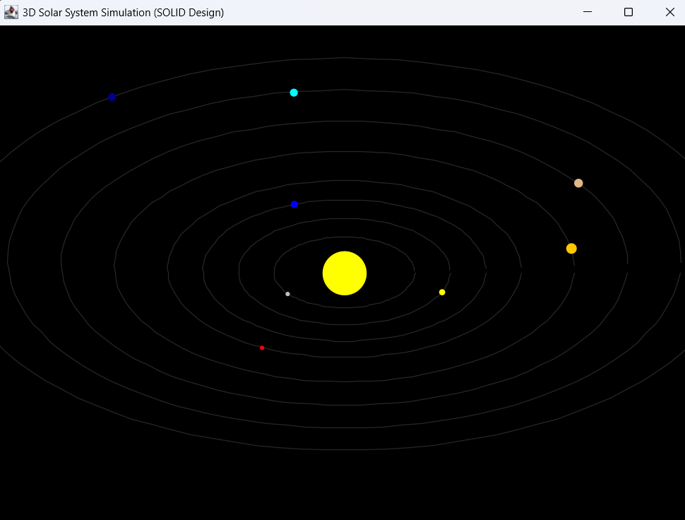

# Solar System Model

Welcome to the Solar System Model project! This project was created as a hands-on exercise to train and apply SOLID project design principles in a Java application. Here, you'll find a simple simulation of a solar system built with clear separation of concerns. Enjoy exploring the code and feel free to experiment with it!

## What Is This Project?

This Java project simulates a solar system where planets orbit around the Sun in a pseudo-3D view (because i haven't use JavaFX). The code is structured following SOLID principles:

- **S**ingle Responsibility: Each class has a single job.
- **O**pen/Closed: The code is designed to be easily extendable.
- **L**iskov Substitution: Components can be replaced with minimal impact.
- **I**nterface Segregation: Each module has a clear, concise purpose.
- **D**ependency Inversion: High-level modules do not depend on low-level modules.

**Modules:**

- **Model**: Contains the data (e.g., planets, positions) in `com.solarSystemModel.model`.
- **View**: Handles rendering and user interface in `com.solarSystemModel.view`.
- **Utility**: Provides helper functionality such as projection calculations in `com.solarSystemModel.util`.


## How to Run

1. **Clone the Repository:**

   ```bash
    git clone https://github.com/WhoCodeThis/SolarSystemModel.git
    cd SolarSystemModel

1. **Import or Build the Project::**

   • In your IDE: Import the project (it’s structured with a src folder) and run the SolarSystemApp class.

   • Using the Command Line: Compile and run the project as follows:
   ```bash
    javac -d bin src/com/solarSystemModel/**/*.java
    java -cp bin com.solarSystemModel.SolarSystemApp

## Screenshot

